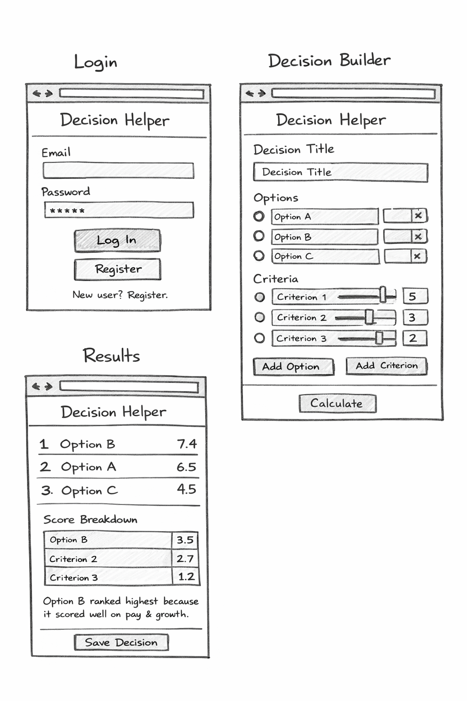

# Decision Helper

[My Notes](notes.md)

Decision Helper is a web app that helps users make difficult choices by breaking decisions into options, criteria, and weighted priorities. Instead of relying on gut feeling alone, users can see a clear, ranked recommendation along with an explanation of how the decision was calculated.

> [!NOTE]
> This is a template for your startup application. You must modify this `README.md` file for each phase of your development. You only need to fill in the section for each deliverable when that deliverable is submitted in Canvas. Without completing the section for a deliverable, the TA will not know what to look for when grading your submission. Feel free to add additional information to each deliverable description, but make sure you at least have the list of rubric items and a description of what you did for each item.

> [!NOTE]
> If you are not familiar with Markdown then you should review the [documentation](https://docs.github.com/en/get-started/writing-on-github/getting-started-with-writing-and-formatting-on-github/basic-writing-and-formatting-syntax) before continuing.

## 🚀 Specification Deliverable

> [!NOTE]
> Fill in this sections as the submission artifact for this deliverable. You can refer to this [example](https://github.com/webprogramming260/startup-example/blob/main/README.md) for inspiration.

For this deliverable I did the following. I checked the box `[x]` and added a description for things I completed.

- [x] Proper use of Markdown
- [x] A concise and compelling elevator pitch
- [x] Description of key features
- [x] Description of how you will use each technology
- [x] One or more rough sketches of your application. Images must be embedded in this file using Markdown image references.

### Elevator pitch

Decision Helper is a simple web application designed to reduce the stress of decision-making. Users enter their available options, define the criteria that matter to them, and assign weights based on importance. The app calculates a ranked outcome and explains why one option rises to the top, helping users feel confident and intentional about their choices.

### Design

**Design notes**
- Login/Register screen for returning users
- Decision Builder screen with options, criteria, and weight inputs
- Results screen showing ranked outcomes and score breakdowns

### Key features

- Create decisions with multiple options
- Define criteria and assign importance weights
- Automatically calculate and rank outcomes
- View clear explanations of how scores were computed
- Save past decisions and revisit them later

### Technologies

I am going to use the required technologies in the following ways.

- **HTML** - Semantic page structure for login, decision creation, and results views using forms, inputs, lists, and buttons.
- **CSS** - Clean, minimal styling with responsive layouts using flexbox or grid, emphasizing readability and visual hierarchy.
- **React** - Single-page application with routed views (login, builder, results, history) and reusable components that update dynamically as user input changes.
- **Service** - Backend endpoints to create, update, score, and retrieve decisions, along with authentication and protected routes.
- **DB/Login** - MongoDB used to store users, hashed credentials, decisions, criteria, weights, and scores so users can access saved decisions.
- **WebSocket** - Real-time updates to decision results when values change, or shared decision sessions where updates are broadcast live.

## 🚀 AWS deliverable

For this deliverable I did the following. I checked the box `[x]` and added a description for things I completed.

- [ ] **Server deployed and accessible with custom domain name** - [My server link](https://yourdomainnamehere.click).

## 🚀 HTML deliverable

For this deliverable I did the following. I checked the box `[x]` and added a description for things I completed.

- [x] **HTML pages**  
  I created individual HTML pages for Home, Play, Scores, and About views.
- [x] **Proper HTML element usage**  
  Pages use the correct semantic HTML elements including a header, nav, main, section, footer, table, and necessary headings.
- [x] **Links**  
  The navigation links allow users to move between all of the pages.
- [x] **Text**  
  Each page includes a description that explains its purpose.
- [x] **3rd party API placeholder**  
  The About page has a placeholder section ready for for third-party API data once it's implemented.
- [x] **Images**  
  The About page has an image depicting a mock-up of the application concept.
- [x] **Login placeholder**  
  The Home page has a placeholder for login functionality to be implemented in the future.
- [x] **DB data placeholder**  
  The Scores page has a placeholder table for data that will later be loaded from a database.
- [x] **WebSocket placeholder**  
  A real-time update area will be added in a future deliverable.

- Production Startup URL: https://tnich-startup.click
- Production Simon URL: https://simon.tnich-startup.click
- Notes: See `notes.md` for the steps I took, including deploying the official `simon-html` example using `deployFiles.sh`.

## 🚀 CSS deliverable

For this deliverable I did the following. I checked the box `[x]` and added a description for things I completed.

- [x] **Visually appealing colors and layout. No overflowing elements.**
  I applied a consistent dark theme (background, panels, borders, and accent color) and verified the UI does not overflow on smaller screens. The Scores table is wrapped in a container that allows horizontal scrolling if needed.

- [x] **Use of a CSS framework**
  I included Bootstrap 5 via CDN and used Bootstrap utility classes alongside custom CSS in `main.css`.

- [x] **All visual elements styled using CSS**
  All pages share the same `main.css` styling for the header/nav/main/footer, cards, tables, and buttons. No inline `style=""` attributes are used.

- [x] **Responsive to window resizing using flexbox and/or grid display**
  The layout is responsive when resizing the window. The shared layout uses flexbox, the navigation wraps on small widths, and content is constrained to a max width.

- [x] **Use of an imported font**
  I imported the Inter font from Google Fonts in `main.css` using `@import` and applied it site-wide via `font-family`.

- [x] **Use of different types of selectors including element, class, ID, and pseudo selectors**
  `main.css` demonstrates element selectors (e.g., `body`, `label`, `table`), class selectors (e.g., `.app-shell`, `.cardish`, `.site-nav`), ID selectors (e.g., `#site-header`, `#site-footer`), and pseudo selectors (e.g., `a:hover`, `button:hover`).

- Production Startup URL: https://startup.tnich-startup.click
- Production Simon URL: https://simon.tnich-startup.click
- Notes: See `notes.md` for additional implementation notes.

## 🚀 React part 1: Routing deliverable

For this deliverable I did the following. I checked the box `[x]` and added a description for things I completed.

- [ ] **Bundled using Vite** - I did not complete this part of the deliverable.
- [ ] **Components** - I did not complete this part of the deliverable.
- [ ] **Router** - I did not complete this part of the deliverable.

## 🚀 React part 2: Reactivity deliverable

For this deliverable I did the following. I checked the box `[x]` and added a description for things I completed.

- [ ] **All functionality implemented or mocked out** - I did not complete this part of the deliverable.
- [ ] **Hooks** - I did not complete this part of the deliverable.

## 🚀 Service deliverable

For this deliverable I did the following. I checked the box `[x]` and added a description for things I completed.

- [ ] **Node.js/Express HTTP service** - I did not complete this part of the deliverable.
- [ ] **Static middleware for frontend** - I did not complete this part of the deliverable.
- [ ] **Calls to third party endpoints** - I did not complete this part of the deliverable.
- [ ] **Backend service endpoints** - I did not complete this part of the deliverable.
- [ ] **Frontend calls service endpoints** - I did not complete this part of the deliverable.
- [ ] **Supports registration, login, logout, and restricted endpoint** - I did not complete this part of the deliverable.

## 🚀 DB deliverable

For this deliverable I did the following. I checked the box `[x]` and added a description for things I completed.

- [ ] **Stores data in MongoDB** - I did not complete this part of the deliverable.
- [ ] **Stores credentials in MongoDB** - I did not complete this part of the deliverable.

## 🚀 WebSocket deliverable

For this deliverable I did the following. I checked the box `[x]` and added a description for things I completed.

- [ ] **Backend listens for WebSocket connection** - I did not complete this part of the deliverable.
- [ ] **Frontend makes WebSocket connection** - I did not complete this part of the deliverable.
- [ ] **Data sent over WebSocket connection** - I did not complete this part of the deliverable.
- [ ] **WebSocket data displayed** - I did not complete this part of the deliverable.
- [ ] **Application is fully functional** - I did not complete this part of the deliverable.

## ✅ Startup HTML Deliverable

- Production Startup URL: https://tnich-startup.click
- Production Simon URL: https://simon.tnich-startup.click
- Notes: See `notes.md` for what I changed + how I deployed the official `simon-html` example using `deployFiles.sh`.

